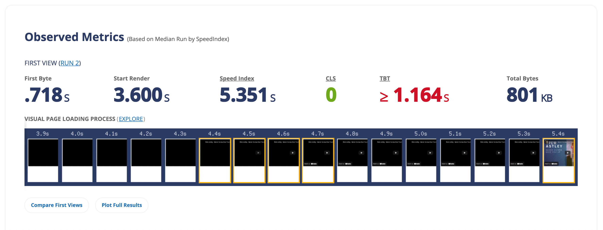

# Overview

`lite-embed` is a simple, fast, and **powerful embedding library** for videos on YouTube and Vimeo for JavaScript.

## Motivation

Often when you want to embed a video on a page, you want to be have a fast and lightweight way to do it. You don't want to load all those scripts and stylesheets, and you don't want to have to wait for the video to load.

**This always comes with a trade-off**: you want to be able to embed videos without having to wait for the video to load, but you also would like to have a fast way to embed videos.

While there are many ways to do this, there are also many ways to do this wrong.

This is how a simple HTML with an `<iframe>` looks like:

It's not very fast, and it's not very lightweight.

Once you start investigating why you're having this problem, you'll find that every `<iframe>` load a lot of scripts and stylesheets. Even if you have not put `autoplay` or `loop` in the `<iframe>`, you still have to load all those scripts and stylesheets for a thumnail to be displayed.

`lite-embed` solves this problem by loading the video with a “fake” element that has the same dimensions as the video. This way, you don't have to load all those scripts and stylesheets, and you don't have to wait for the video to load.

Once you click the `<iframe>` to load the video, the video will be loaded and displayed with the scripts needed to play the video.

In addition to this, when you hover the element, we put some preload links into the `<head>` to allow the browser to preload the scripts domains more efficiently.
